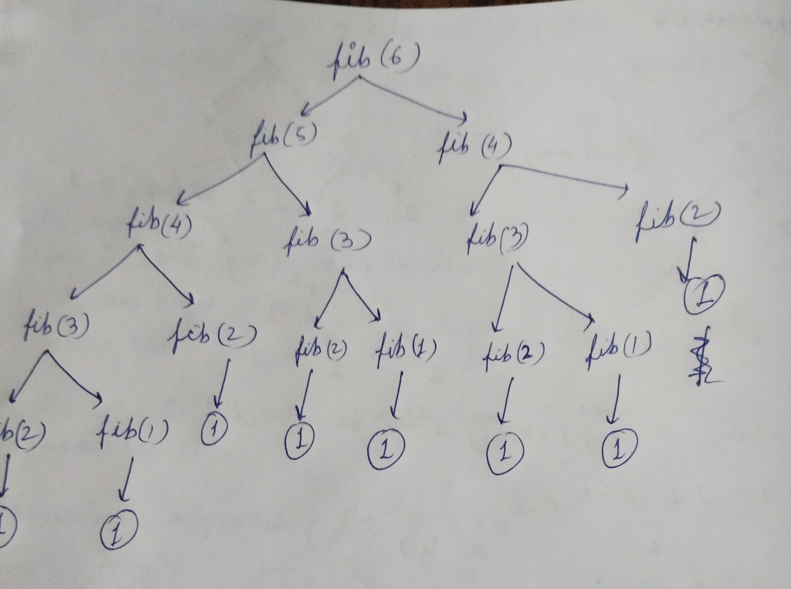

# Recursion

What is Recursion? A function calling itself right?

But it's not that simple.

I had watched [Utkarsh Gupta's](https://youtu.be/0UM_J1jE1dg) video on Recursion a few weeks ago. He builds upon the concept from the ground up and he emphasizes to **Trust the Function**.

> Recursion = Base case + **trust the function**

Let's understand with a simple problem.

### Problem 01

- Print the first N natural numbers.
- Input : N=7
- Output : 1 2 3 4 5 6 7

This problem can be solved using a simple `for` loop, but for the sake of understanding let's try to solve the problem using recursion.

Think : Let's print the Nth number and **_trust the function_** to print remaining N-1 numbers.

```cpp
#include<iostream>
using namespace std;

void printNumbers(int n){
  if(n==0){
    return;
  }
  printNumbers(n-1); // TRUST THE FUNCTION
  cout << n << " ";
}

int main(){
  printNumbers(5); // 1 2 3 4 5
}
```

But altering only two lines reverses the ouput of the program. Why?

```cpp
#include<iostream>
using namespace std;

void printNumbers(int n){
  if(n==0){
    return;
  }
  cout << n << " ";
  printNumbers(n-1); // TRUST THE FUNCTION
}

int main(){
  printNumbers(5); // 5 4 3 2 1
}
```

Can you draw the recursive tree of the algorithms and conclude the following:

- Time Complexity : O(N)
- Space Complexit : O(1)

### Problem 02

- Find the Nth Fibonacci number.
- Input : 6
- Ouput : 21
- Explaination : 1,1,2,3,5,8

The definition of [Fibonacci Sequence](https://en.wikipedia.org/wiki/Fibonacci_sequence) gives away the recursive expression. As the Nth number is sum of (N-1)th and (N-2)th number, the recursion expression is:

`Fib(N) = Fib(N-1) + Fib(N-2), N>2 where Fib(1)=1, Fib(1)=1`

```cpp
#include<iostream>
using namespace std;

int fib(int n){
  if(n==1) return 1;
  if(n==2) return 1;

  return fib(n-1) + fib(n-2); // TRUST THE FUNCTION
}

int main(){
  cout << fib(8) << "\n"; // 8
}
```

Refer to the recursive tree below.



- Time complexity : O(NlogN) why?
- Space complexity : O(1)

You can observe that the algorithms computes the same value multiple times. For example the right half of the tree, fib(4) is previously computed. We can use [Memoization](https://en.wikipedia.org/wiki/Memoization#:~:text=In%20computing%2C%20memoization%20or%20memoisation,the%20same%20inputs%20occur%20again.) to optimize the algorithm.

```cpp
#include<iostream>
#include<map>
using namespace std;

map<int,int> memo;
int fib(int n){
  if(n==1) return 1;
  if(n==2) return 1;

  if(memo.find(n) != mp.end()){
    return memo[n];
  }
  int memo[n] = fib(n-1) + fib(n-2);

  return memo[n]; // TRUST THE FUNCTION
}

int main(){
  cout << fib(8) << "\n"; // 8
}
```

Now that we understand the basics of recursion, let's solve a problem.

# Problem 03 : Pow(x,n)

Implement pow(x, n), which calculates x raised to the power n (i.e., x^n). For full problem description refer directly to [Leetcode](https://leetcode.com/problems/powx-n/description/).

Example 1:

- Input: x = 2.10000, n = 3
- Output: 9.26100

Example 2:

- Input: x = 2.00000, n = -2
- Output: 0.25000
  Explanation: 2-2 = 1/22 = 1/4 = 0.25

### Approach 01 : Brute Force

The first approach that occurred to me was to multiply `x` to itself `n` times. That's what exponentiation is, right? i.e `2^4 = 2*2*2*2`

```cpp
#include<iostream>
using namespace std;

double naivePow(double x, int n){
  double ans = 1;
  if(n==0){
    return 1;
  }else if(n>0){
    for(int i=1;i<=n;i++){
      ans*=x;
    }
  }else{
    for(int i=n;i<0;i++){
      ans/=x;
    }
  }
  return ans;
}
```

We also need to keep in mind the case when `n<0`, so instead of multipying `n` times we need to divide.

- Time : O(N)
- Space : O(1)
- Verdict : Time Limit Exceeded

### Approach 02 : Recursive

Try to think it this way:

- 2^4 = 2 \* 2^3
- 2^3 = 2 \* 2^2
- 2^2 = 2 \* 2^1
- 2^1 = 2

Think : We **_trust the function_** to calculate the `x^(n-1)` and then multiply with x

```cpp
double PowRecurse(double x, int n) {
  if(n==0){
    return 1;
  }else if(n>0){
    return x * PowRecurse(x,n-1);
  }else {
    return (1/x) * PowRecurse(x,n+1);
  }
}
```

observe that we handle the case for positive and negative powers separately.

- Recursive Expression : T(N) = 2\*T(N/2) + c , why?
- Time : O(N)
- Space : O(1)
- Verdict : Time Limit Exceeded

### Approach 03 : Recursive by splitting in half

Think : We can write 2^10 as

- 2^10 = 2^5 \* 2^5;
- 2^5 = 2 \* 2^4;
- 2^4 = 2^2 \* 2^2
  and so on.

Based on whether n is even or odd, we can split the tree and recurse.

```cpp
double myPowRecurseOptimal(double x, int n) {
  if(n==0){
    return 1;
  }else if(n>0){
    return n%2==0 ? myPowRecurse(x,n/2) * myPowRecurse(x,n/2) : x * myPowRecurse(x,n-1);
  }else {
    return n%2==0 ? myPowRecurse(x,n/2) * myPowRecurse(x,n/2) : 1/x * myPowRecurse(x,n+1);
  }
}
```

- Time : I think it's still O(N)?
- Space : O(1)
- Verdict : Time Limit Exceeded

### Approach 04 : Binary exponentiation

After getting TLE thrice, I watched a [video](https://youtu.be/WBzZCm46mFo) on YouTube.

Given the constraints on n, (`-2^31 <= n <= 2&31-1`), we need an algorithm that runs in O(logN) time.

> Any decimal number N, has atmost log(N)+1 digits in its binary form.

For example , n=5 can be written in binary as `101`.
To calculate x=3, n=5 we can simply multiply the powers 3^1 and 3^4 when the binary form has a 1.

We keep calculating the sqaures of `x` and multiply in ans if in binary form of `n` the last digit is 1.

```cpp
double myPow(double x, int n) {
  if(n==0) return 1.0;
  if(n==1) return x;
  if(x==0) return 0.0;
  if(x==-1 && n%2==0) return 1.0;
  if(x==-1 && n%2!=0) return -1.0;

  long bin = n;
  if(n<0){
      x = 1/x;
      bin = -bin;
  }

  double ans = 1;

  while(bin > 0){
      if(bin%2==1){
          ans*=x;
      }
      x*=x;
      bin/=2;
  }

  return ans;
  }
```

- Time : O(logN)
- Space : O(1)
- Verdict : Accepted

# Fin
Today I refreshed the basics of recursion, understanding how to think _recursively_. The next step is to understand how to find recursive expression for any algorithm and find it's time and space complexity.
I am going to read more on recursion and analysis of algorithms from the book "Introduction to Algorithms".
If there are any mistakes please let me know.
Thanks!